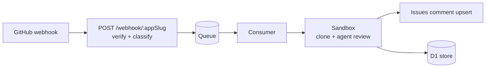

<div align="center">


# [Morning Star Inspector](https://github.com/btspoony/mstar-inspector)

Self-hosted GitHub App for automated PR reviews

English / [中文](README_CN.md)

[](https://github.com/btspoony/mstar-inspector/actions/workflows/ci.yml)
[](LICENSE)
[](https://github.com/btspoony/mstar-inspector/commits/main)

</div>

**mstar-inspector** is a self-hosted GitHub App that reviews pull requests the
moment they open or update. Each review runs as a real multi-seat coding-agent
session inside an isolated Cloudflare Sandbox container, posts its result as a
single upserted comment on the PR, and stores structured findings in D1 for
later analysis.

- **Multi-App from one deployment** — register any number of GitHub Apps through the dashboard; each gets its own slug, encrypted credentials, BYOK provider keys, and model chain
- **Isolated execution** — every review runs in a one-shot Cloudflare Sandbox container (clone → review → destroy), with no secrets baked into the image
- **Structured results** — reviews emit a `mstar.review/v1` envelope (verdict + classified findings) stored in D1, so dedup, recurrence, and health analytics are possible later
- **Retained finding lifecycle** — unresolved findings survive across rounds: each round re-verifies them against the current code and discussion, reports the outcome in the same overall comment, and automatically resolves only the Inspector-owned review threads it can prove are its own and positively fixed (a finding's *addressed* disposition is never equated with a *resolved* GitHub thread)
- **Per-App trigger modes** — each App picks when reviews auto-start on its settings page: `open` (first open only), `every_push` (default — open, push, reopen) or `manual` (never auto); in every mode a PR comment that @mentions the App's bot (`@your-app-slug[bot]`) from the PR author or the repo owner (re-)starts a review
- **Fail-closed by design** — the global kill-switch blocks new reviews (including their model runs), publications and line-comment creation; only the bounded [recovery exceptions](docs/deploy.md#lifecycle-recovery-7111) may still finish already-authorized work, and only for an otherwise active App. Every App must bring its own provider keys and model chain: a misconfigured App's reviews fail loudly, never on someone else's credentials

## Architecture



## Quick start

Two deployment paths — pick the one that matches who you are:

- **Self-hosting your own copy** (forks, private deployments) → **Path A**: deploy a pinned release to your own Cloudflare account.
- **Working on this repo** → **Path B**: merging to `main` deploys staging automatically.

> Prerequisites (both paths): a [Cloudflare](https://developers.cloudflare.com/workers/) account (Workers + D1 + Queues + Containers), a GitHub account, and [Bun](https://bun.sh) ≥ 1.3.14 locally. The full runbook — Cloudflare resource setup, D1 migrations, secrets inventory, go-live checklist — lives in [`docs/deploy.md`](docs/deploy.md).

### Path A — deploy your own copy (pinned release)

1. **Pin a released version** — published releases are tagged (see the [Releases page](https://github.com/btspoony/mstar-inspector/releases)); deploying a tag gives you that exact source, and the sandbox container image is rebuilt from that checkout at deploy time:

   ```bash
   git clone https://github.com/btspoony/mstar-inspector && cd mstar-inspector
   git checkout <tag>          # e.g. v1.0.0
   bun install
   ```

2. **Create your Cloudflare resources** and point the config at them — the two ids committed in `wrangler.jsonc` are this repo's, replace both with yours:

   ```bash
   wrangler queues create review-queue
   wrangler queues create review-dlq
   wrangler kv namespace create IDEMPOTENCY_KV   # new id → wrangler.jsonc kv_namespaces
   wrangler d1 create mstar-inspector-db         # new id → wrangler.jsonc d1_databases
   ```

3. **Apply D1 migrations**:

   ```bash
   wrangler d1 migrations apply mstar-inspector-db --remote
   ```

4. **Set the four Worker secrets** (Worker-level names, direct — no GitHub Secrets involved; values: two `openssl rand -base64 32`, plus a GitHub **OAuth App** whose callback is `{origin}/dashboard/oauth/callback`). The review GitHub App is NOT a Worker secret — it gets registered per-App through the dashboard later:

   ```bash
   wrangler secret put GITHUB_OAUTH_CLIENT_ID
   wrangler secret put GITHUB_OAUTH_CLIENT_SECRET
   wrangler secret put DASHBOARD_SESSION_SECRET
   wrangler secret put DASHBOARD_ENCRYPTION_KEY
   ```

5. **Build, deploy, verify** — `/healthz` reports the deployed version, so you can confirm the tag you pinned is what's running:

   ```bash
   bun run build:spa        # required — the SPA assets are not committed
   wrangler deploy          # also builds/pushes the sandbox container image
   curl https://<your-worker>/healthz   # {"ok":true,"version":"vX.Y.Z"}
   ```

6. Continue with **step 3 below** (sign in and register your GitHub App).

### Path B — this repo's staging (maintainers)

1. **Deploy** — merging to `main` deploys automatically via the [Deploy workflow](.github/workflows/deploy.yml) (secrets → D1 migrations → `wrangler deploy` → smoke → digest record). For a manual/local deploy:

   ```bash
   bun install
   bun run build:spa
   wrangler deploy
   ```

2. **Set the dashboard secrets** (four; no review credentials live at Worker level) — as **GitHub Secrets** (Settings → Environments → `staging` → Secrets), which the Deploy workflow injects into the Worker on every deploy. This staging-environment mapping is this repo's automation only — a self-hosted copy (Path A) sets the same four values directly on the Worker:

   ```bash
   # generate values locally, then add them under the staging environment:
   openssl rand -base64 32    # DASHBOARD_ENCRYPTION_KEY — encrypts per-App credentials in D1
   openssl rand -base64 32    # DASHBOARD_SESSION_SECRET — session-cookie HMAC key
   # OAUTH_CLIENT_ID / OAUTH_CLIENT_SECRET — a GitHub OAuth App
   # whose callback is {origin}/dashboard/oauth/callback
   # (GitHub forbids the GITHUB_ prefix on secret names, so the GitHub-side
   #  names drop it; the Worker still receives GITHUB_OAUTH_CLIENT_ID /
   #  GITHUB_OAUTH_CLIENT_SECRET via the Deploy workflow's bulk mapping.
   #  OAUTH_CLIENT_ID is a variable — client id is not sensitive;
   #  OAUTH_CLIENT_SECRET is a secret.)
   ```

### Then (both paths)

3. **Sign in and register a GitHub App** — visit `https://<your-worker>/dashboard`, sign in with GitHub, and follow the **Register App** manifest flow. It creates the GitHub App on your account with a per-App webhook URL of the form `{origin}/webhook/<slug>`, stores the PEM and webhook secret encrypted in D1, and shows you the exact webhook URL to set.

4. **Configure the App** — on the dashboard Settings page for the App, add the provider API key(s) the review model needs (BYOK, encrypted in D1) and a model chain. An App without these fails its reviews closed — see [Per-App configuration](#per-app-configuration).

5. **Enable reviews and open a PR** — reviews are on per App by default (the dashboard Pause/Resume switch is the control; the Worker var `REVIEW_ENABLED` is an emergency brake that stops ALL reviews only when set to exactly `"false"`), then open or update a PR in a repo where the App is installed.

   The review runs in a sandbox container and its result appears as one comment on the PR (upserted — no comment spam across force-pushes).

## How reviews work

- **Per-App routing**: GitHub delivers webhooks to `POST /webhook/:appSlug`. The Worker resolves the slug, verifies the signature with that App's own decrypted secret, and enqueues a review job tagged with the App's identity. There is no other review entry point.
- **Queue → Sandbox**: a Cloudflare Queue consumer clones the PR inside a one-shot Sandbox container and runs a multi-seat agent session — see [Agent runtimes](#agent-runtimes).
- **Purpose-scoped credentials**: the Worker mints two installation grants from one auth point, each restricted to the one repository. The Sandbox always receives the `sandbox-read` grant (`contents: read`, `metadata: read`, `pull_requests: read` — the last covers the `gh pr diff` step, which runs with exactly this token) and the Worker asserts the *returned* capabilities before use, so a broader or unscoped token fails closed and never reaches a review container. GitHub writes ride a separate `review-write` grant.
- **Permissions**: the App manifest requests `contents: write`, `metadata: read`, `pull_requests: write`, `issues: write`, `checks: write`. `contents: write` exists for exactly one Worker-only purpose — resolving positively verified, Inspector-owned review threads — and grants no model, push, merge or code-write authority. `checks: write` exists for the advisory review Check Run only.
- **Advisory Check runs**: an eligible review appears as an in-progress Check Run named `mstar-inspector review` on the reviewed commit, then terminalizes to `success`, `neutral` or `failure`. A `success` conclusion means the review **was published** — it is **never** an approval, a merge gate or a `REQUEST_CHANGES` equivalent, and the app never requests either. Conclusions are decided from persisted publication proof, not from the code path: a confirmed normal publication is `success` for every engine verdict, a confirmed degraded publication is `neutral`, and an execution failure or an unconfirmed publication is `failure`. Check failure never blocks or delays the review itself. The summary states which case it is, and no `details_url` is set. Branch protection stays **user-controlled** — this app does not configure, require or recommend a required status check.
- **Two runs of one Check name are possible**: local attempt fencing is not external exactly-once (RL-12). If a create attempt is unconfirmed — the response was lost, or a refusal landed after the request was dispatched — that attempt is settled **read-only** by recovery: it adopts and terminalizes, and never creates a second run. `external_id` is correlation, not a server-side idempotency key, so a **later attempt for the same commit** (a fresh generation with its own `external_id`) creates its own run rather than adopting the earlier one. GitHub then shows **two runs of `mstar-inspector review`** for that commit, and the **newest applicable attempt** is authoritative — it carries the latest persisted proof. Duplicate runs are not a duplicate review and are never a reason to publish twice.
- **Addressed is not resolved**: a finding is `addressed` from typed code evidence; a GitHub thread is `resolved` only after the Worker proves the thread is its own (opaque Inspector association plus the App's authenticated identity), re-checks the reviewed HEAD and the exact conversation it inspected, and receives a confirmed `isResolved` from GitHub. Failures, ambiguity and stale context keep the row open and visible instead of claiming a resolve.
- **Crash-safe publication**: the complete publication payload is staged privately in D1 before any GitHub mutation. If a crash or API failure interrupts the send or the subsequent database apply, the 15-minute cron reconciler completes it from that journal — or retries an already-authorized thread resolution — without re-running the paid review, with bounded retries and a visible terminal give-up state. Contract: [`.mstar/specs/review-lifecycle.md`](.mstar/specs/review-lifecycle.md) §7.

> The lifecycle, credential and recovery behavior above is covered by the implementation's scoped behavioral tests and static checks. Live GitHub / GitHub App behavior — the returned installation grant and remote thread resolution in particular — is **not** verified in this repository: no live scoped run was authorized (spec §7.13).


## Agent runtimes

The review runtime is a small port (`AgentRuntime.runReview()` — one method,
in / `mstar.review/v1` out). The review command, seat plan, and structured
findings all come from the [mstar-harness](https://github.com/btspoony/mstar-harness)
plugin; which coding agent executes them is pluggable:

| Runtime | Status |
|---------|--------|
| [omp](https://github.com/oh-my-pi/omp) | **Shipped** — the current adapter (`src/review/runtime-omp.ts`), all review levels (quick / default / deep) |
| dsh and others | Not yet — the port is the extension point; a new adapter plugs in without touching the webhook / queue / store pipeline |

## Per-App configuration

Everything a review needs is configured **per App** on the dashboard Settings page (`/dashboard/apps/<slug>/settings`) — there are no deployment-level provider keys or model-chain knobs to leak between Apps.

- **Provider keys (BYOK)** — encrypted in D1, injected into the review container only from the App's own config, through a fixed provider allowlist (Anthropic, OpenAI, Gemini, Ark, OpenRouter, Groq, and more — the dashboard shows the full list). Custom providers can be declared on the same page.
- **Model chain** — comma-separated model selectors, first = primary, rest = fallback. This is the only chain source.
- **Fail-closed** — a chain-less App, or one whose chain references a provider without a configured key, fails its reviews closed with a structured error (visible on the settings page + `review_failures` table) before any sandbox or token work happens. Configure every App before enabling reviews for it.

## Operations

- **Emergency brake**: per-App `review_enabled` (dashboard Pause/Resume) is the primary review control. The Worker var `REVIEW_ENABLED` stops ALL reviews platform-wide only when set to exactly `"false"` (case-sensitive, untrimmed); unset / `""` / `"true"` / other → per-App governs. Leave it unset.
- **Deploys are automated on this repo**: merging to `main` runs the [Deploy workflow](.github/workflows/deploy.yml) — secrets injection, D1 migrations, `wrangler deploy`, post-deploy smoke, and the image-digest record. A failed run stops red (no auto-rollback); see [`docs/deploy.md`](docs/deploy.md) for failure semantics and the manual rollback path. Self-hosting your own copy? You deploy manually (or wire your own pipeline) — see [Path A](#path-a--deploy-your-own-copy-pinned-release).
- **Releases are versioned**: a release is cut by merging a `release vX.Y.Z` PR, which tags the release and publishes a GitHub Release with bilingual changelog and deploy evidence — see [`docs/release.md`](docs/release.md) and the [Releases page](https://github.com/btspoony/mstar-inspector/releases).
- **Secrets inventory, deploy steps, rollback, and the full Multi-App go-live checklist** → [`docs/deploy.md`](docs/deploy.md).

## Local development

```bash
bun install
bun run typecheck
bun test
```

- Local `wrangler dev` secrets go in `.dev.vars` (gitignored) — see `.env.example`.
- Review runner CLI (the in-image entry): `bun run review --level <quick|default> --input <json-file>` — prints the `mstar.review/v1` envelope JSON on stdout.
- Sandbox smoke: `bun run scripts/sandbox-smoke.ts` (requires `SMOKE_APP_ID` / `SMOKE_PRIVATE_KEY`; see the file header) — it mints the same repository-scoped **read-only** `sandbox-read` grant the Worker uses and fails closed on any broader returned capability; full runbook in [`docs/deploy.md`](docs/deploy.md#sandbox-smoke).

## Documentation

| Document | What it covers |
|----------|----------------|
| [`docs/deploy.md`](docs/deploy.md) | Deploy docs: automated-deploy primary path (workflow triggers + failure semantics), Cloudflare resources, D1 migrations, secrets inventory, manual reference steps, Multi-App go-live checklist, rollback |
| [`docs/release.md`](docs/release.md) | Release docs: cutting a versioned release (fragment changelog → `release vX` PR → tag + GitHub Release), the first-cut live-verification checklist, failure/recovery paths |

## License

[MIT](LICENSE)
